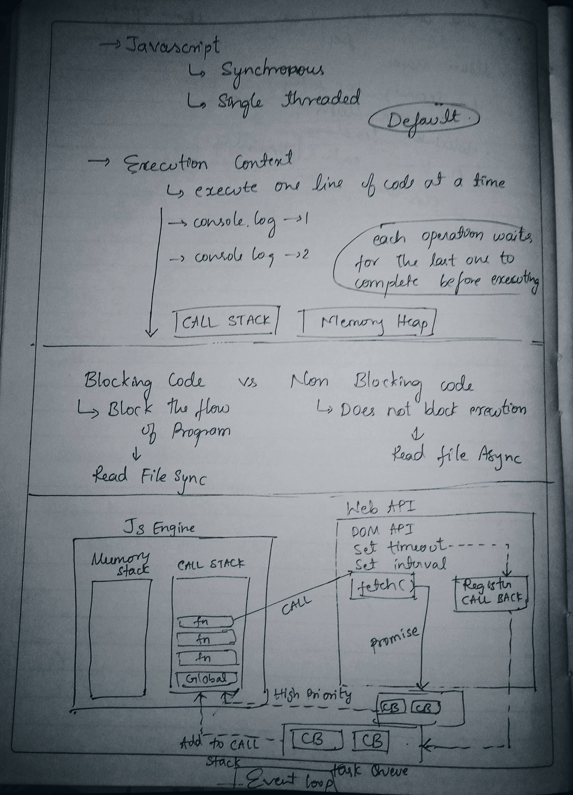

**I. Core JavaScript Concepts**

- **Synchronous:** Operations execute sequentially; each waits for the previous to complete.
  - **Single-threaded:** JavaScript has one main thread for execution.
  - **Execution Context:** Environment where code is evaluated (Global, Function).
  - **Call Stack:** LIFO (Last-In, First-Out) stack managing function calls.
  - **Memory Heap:** Region for memory allocation of variables & objects.
  - **Default Behavior:** JavaScript is **synchronous** and **single-threaded** by default.

**II. Blocking vs. Non-Blocking Code**

- **Blocking Code:** Halts the program's execution until the operation finishes.
  - **Example:** Synchronous file read ($$fs.readFileSync$$).
  - **Use Case:** Critical operations requiring immediate confirmation (e.g., database write before user notification).
- **Non-Blocking Code:** Allows other operations to proceed while waiting for a task to complete.
  - **Example:** Asynchronous file read ($$fs.readFile$$), network requests.
  - **Benefit:** Improves responsiveness and performance by delegating long-running tasks.

**III. Asynchronous JavaScript & Event Loop**

- **Asynchronous JavaScript:** Achieved through the **Runtime Environment** (Browser, Node.js, Deno), not the JS Engine alone.
- **Runtime Environment Components:**

  - **JavaScript Engine:** (e.g., V8) Contains Call Stack & Memory Heap.
  - **Web APIs / Node APIs:** Provided by the runtime for asynchronous operations (e.g., $$setTimeout$$, $$setInterval$$, DOM events, $$fetch$$).
  - **Task Queue (Callback Queue):** FIFO queue for callbacks from Web APIs (e.g., $$setTimeout$$, $$setInterval$$, I/O operations).
  - **Microtask Queue (Promise Queue / High Priority Queue):** Higher priority FIFO queue for callbacks from Promises (e.g., $$.then()$$, $$.catch()$$, $$async/await$$).
  - **Event Loop:** Continuously monitors the Call Stack and queues, moving callbacks to the Call Stack when it's empty.

- **$$setTimeout(callback, 0)$$ Behavior:**
  - Even with $$0$$ delay, the callback is delegated to Web APIs, then placed in the Task Queue.
  - It will only execute _after_ all synchronous code and any pending Microtasks have completed.
  - **Example Output:**
    ```javascript
    console.log(1);
    setTimeout(() => console.log(2), 0);
    console.log(3);
    // Output: 1, 3, 2
    ```
- **$$fetch$$ API:**
  - A modern API for network requests.
  - Returns a Promise, so its callbacks are handled by the **Microtask Queue**, giving them higher priority over regular Task Queue callbacks.

**IV. Important Notes**

- The JavaScript engine itself is single-threaded, but the runtime environment (browser, Node.js) provides the capabilities for asynchronous operations by delegating tasks.
- Understanding the Event Loop is crucial for writing efficient and non-blocking JavaScript code, especially for interview contexts.


